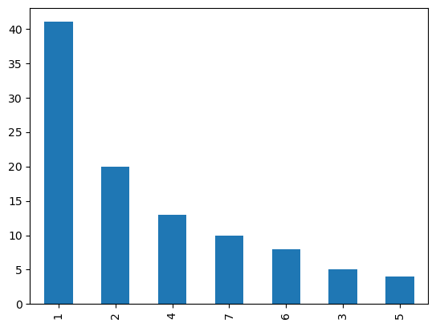

```python
import pandas as pd
import numpy as np

from matplotlib import pyplot as plt  
%matplotlib inline
```


```python
zoo = pd.read_csv('zoo.csv')
```

### Extract basic information 
- 18 columns and 101 entries
- no null values 


```python
zoo.info()
```

    <class 'pandas.core.frame.DataFrame'>
    RangeIndex: 101 entries, 0 to 100
    Data columns (total 18 columns):
     #   Column       Non-Null Count  Dtype 
    ---  ------       --------------  ----- 
     0   animal_name  101 non-null    object
     1   hair         101 non-null    int64 
     2   feathers     101 non-null    int64 
     3   eggs         101 non-null    int64 
     4   milk         101 non-null    int64 
     5   airborne     101 non-null    int64 
     6   aquatic      101 non-null    int64 
     7   predator     101 non-null    int64 
     8   toothed      101 non-null    int64 
     9   backbone     101 non-null    int64 
     10  breathes     101 non-null    int64 
     11  venomous     101 non-null    int64 
     12  fins         101 non-null    int64 
     13  legs         101 non-null    int64 
     14  tail         101 non-null    int64 
     15  domestic     101 non-null    int64 
     16  catsize      101 non-null    int64 
     17  class_type   101 non-null    int64 
    dtypes: int64(17), object(1)
    memory usage: 14.3+ KB
    

### Extacting unique number of high-level classes
-  Plot the unique number of labels obtained using the matplotlib
- 7 unique class labels


```python
labels = zoo ['class_type'] 
print(np.unique(labels.values))

fig, ax = plt.subplots()
(labels.value_counts()).plot(ax=ax,kind='bar')
```

    [1 2 3 4 5 6 7]
    


    <AxesSubplot:>


    

    


### Clustering 


```python
zoo.head()
```


<div>
<style scoped>
    .dataframe tbody tr th:only-of-type {
        vertical-align: middle;
    }

    .dataframe tbody tr th {
        vertical-align: top;
    }

    .dataframe thead th {
        text-align: right;
    }
</style>
<table border="1" class="dataframe">
  <thead>
    <tr style="text-align: right;">
      <th></th>
      <th>animal_name</th>
      <th>hair</th>
      <th>feathers</th>
      <th>eggs</th>
      <th>milk</th>
      <th>airborne</th>
      <th>aquatic</th>
      <th>predator</th>
      <th>toothed</th>
      <th>backbone</th>
      <th>breathes</th>
      <th>venomous</th>
      <th>fins</th>
      <th>legs</th>
      <th>tail</th>
      <th>domestic</th>
      <th>catsize</th>
      <th>class_type</th>
    </tr>
  </thead>
  <tbody>
    <tr>
      <th>0</th>
      <td>aardvark</td>
      <td>1</td>
      <td>0</td>
      <td>0</td>
      <td>1</td>
      <td>0</td>
      <td>0</td>
      <td>1</td>
      <td>1</td>
      <td>1</td>
      <td>1</td>
      <td>0</td>
      <td>0</td>
      <td>4</td>
      <td>0</td>
      <td>0</td>
      <td>1</td>
      <td>1</td>
    </tr>
    <tr>
      <th>1</th>
      <td>antelope</td>
      <td>1</td>
      <td>0</td>
      <td>0</td>
      <td>1</td>
      <td>0</td>
      <td>0</td>
      <td>0</td>
      <td>1</td>
      <td>1</td>
      <td>1</td>
      <td>0</td>
      <td>0</td>
      <td>4</td>
      <td>1</td>
      <td>0</td>
      <td>1</td>
      <td>1</td>
    </tr>
    <tr>
      <th>2</th>
      <td>bass</td>
      <td>0</td>
      <td>0</td>
      <td>1</td>
      <td>0</td>
      <td>0</td>
      <td>1</td>
      <td>1</td>
      <td>1</td>
      <td>1</td>
      <td>0</td>
      <td>0</td>
      <td>1</td>
      <td>0</td>
      <td>1</td>
      <td>0</td>
      <td>0</td>
      <td>4</td>
    </tr>
    <tr>
      <th>3</th>
      <td>bear</td>
      <td>1</td>
      <td>0</td>
      <td>0</td>
      <td>1</td>
      <td>0</td>
      <td>0</td>
      <td>1</td>
      <td>1</td>
      <td>1</td>
      <td>1</td>
      <td>0</td>
      <td>0</td>
      <td>4</td>
      <td>0</td>
      <td>0</td>
      <td>1</td>
      <td>1</td>
    </tr>
    <tr>
      <th>4</th>
      <td>boar</td>
      <td>1</td>
      <td>0</td>
      <td>0</td>
      <td>1</td>
      <td>0</td>
      <td>0</td>
      <td>1</td>
      <td>1</td>
      <td>1</td>
      <td>1</td>
      <td>0</td>
      <td>0</td>
      <td>4</td>
      <td>1</td>
      <td>0</td>
      <td>1</td>
      <td>1</td>
    </tr>
  </tbody>
</table>
</div>


- Extract the features leaving the labels column and store them in another data frame


```python
features = zoo.values[:,1:-1]
features.shape
```


    (101, 16)


- Specify the total number of clusters as seven 
- There are seven uniques class labels
- Specify the linkage method as avg
- Similiarity method as cosine 


```python
from sklearn.cluster import AgglomerativeClustering
from sklearn.metrics import pairwise_distances

model = AgglomerativeClustering(n_clusters=7,linkage='average', affinity='cosine')

```

- Fit 50 agglomerative clustering model over the feature variable 


```python
model.fit(features)
```


<style>#sk-container-id-1 {color: black;background-color: white;}#sk-container-id-1 pre{padding: 0;}#sk-container-id-1 div.sk-toggleable {background-color: white;}#sk-container-id-1 label.sk-toggleable__label {cursor: pointer;display: block;width: 100%;margin-bottom: 0;padding: 0.3em;box-sizing: border-box;text-align: center;}#sk-container-id-1 label.sk-toggleable__label-arrow:before {content: "▸";float: left;margin-right: 0.25em;color: #696969;}#sk-container-id-1 label.sk-toggleable__label-arrow:hover:before {color: black;}#sk-container-id-1 div.sk-estimator:hover label.sk-toggleable__label-arrow:before {color: black;}#sk-container-id-1 div.sk-toggleable__content {max-height: 0;max-width: 0;overflow: hidden;text-align: left;background-color: #f0f8ff;}#sk-container-id-1 div.sk-toggleable__content pre {margin: 0.2em;color: black;border-radius: 0.25em;background-color: #f0f8ff;}#sk-container-id-1 input.sk-toggleable__control:checked~div.sk-toggleable__content {max-height: 200px;max-width: 100%;overflow: auto;}#sk-container-id-1 input.sk-toggleable__control:checked~label.sk-toggleable__label-arrow:before {content: "▾";}#sk-container-id-1 div.sk-estimator input.sk-toggleable__control:checked~label.sk-toggleable__label {background-color: #d4ebff;}#sk-container-id-1 div.sk-label input.sk-toggleable__control:checked~label.sk-toggleable__label {background-color: #d4ebff;}#sk-container-id-1 input.sk-hidden--visually {border: 0;clip: rect(1px 1px 1px 1px);clip: rect(1px, 1px, 1px, 1px);height: 1px;margin: -1px;overflow: hidden;padding: 0;position: absolute;width: 1px;}#sk-container-id-1 div.sk-estimator {font-family: monospace;background-color: #f0f8ff;border: 1px dotted black;border-radius: 0.25em;box-sizing: border-box;margin-bottom: 0.5em;}#sk-container-id-1 div.sk-estimator:hover {background-color: #d4ebff;}#sk-container-id-1 div.sk-parallel-item::after {content: "";width: 100%;border-bottom: 1px solid gray;flex-grow: 1;}#sk-container-id-1 div.sk-label:hover label.sk-toggleable__label {background-color: #d4ebff;}#sk-container-id-1 div.sk-serial::before {content: "";position: absolute;border-left: 1px solid gray;box-sizing: border-box;top: 0;bottom: 0;left: 50%;z-index: 0;}#sk-container-id-1 div.sk-serial {display: flex;flex-direction: column;align-items: center;background-color: white;padding-right: 0.2em;padding-left: 0.2em;position: relative;}#sk-container-id-1 div.sk-item {position: relative;z-index: 1;}#sk-container-id-1 div.sk-parallel {display: flex;align-items: stretch;justify-content: center;background-color: white;position: relative;}#sk-container-id-1 div.sk-item::before, #sk-container-id-1 div.sk-parallel-item::before {content: "";position: absolute;border-left: 1px solid gray;box-sizing: border-box;top: 0;bottom: 0;left: 50%;z-index: -1;}#sk-container-id-1 div.sk-parallel-item {display: flex;flex-direction: column;z-index: 1;position: relative;background-color: white;}#sk-container-id-1 div.sk-parallel-item:first-child::after {align-self: flex-end;width: 50%;}#sk-container-id-1 div.sk-parallel-item:last-child::after {align-self: flex-start;width: 50%;}#sk-container-id-1 div.sk-parallel-item:only-child::after {width: 0;}#sk-container-id-1 div.sk-dashed-wrapped {border: 1px dashed gray;margin: 0 0.4em 0.5em 0.4em;box-sizing: border-box;padding-bottom: 0.4em;background-color: white;}#sk-container-id-1 div.sk-label label {font-family: monospace;font-weight: bold;display: inline-block;line-height: 1.2em;}#sk-container-id-1 div.sk-label-container {text-align: center;}#sk-container-id-1 div.sk-container {/* jupyter's `normalize.less` sets `[hidden] { display: none; }` but bootstrap.min.css set `[hidden] { display: none !important; }` so we also need the `!important` here to be able to override the default hidden behavior on the sphinx rendered scikit-learn.org. See: https://github.com/scikit-learn/scikit-learn/issues/21755 */display: inline-block !important;position: relative;}#sk-container-id-1 div.sk-text-repr-fallback {display: none;}</style><div id="sk-container-id-1" class="sk-top-container"><div class="sk-text-repr-fallback"><pre>AgglomerativeClustering(affinity=&#x27;cosine&#x27;, linkage=&#x27;average&#x27;, n_clusters=7)</pre><b>In a Jupyter environment, please rerun this cell to show the HTML representation or trust the notebook. <br />On GitHub, the HTML representation is unable to render, please try loading this page with nbviewer.org.</b></div><div class="sk-container" hidden><div class="sk-item"><div class="sk-estimator sk-toggleable"><input class="sk-toggleable__control sk-hidden--visually" id="sk-estimator-id-1" type="checkbox" checked><label for="sk-estimator-id-1" class="sk-toggleable__label sk-toggleable__label-arrow">AgglomerativeClustering</label><div class="sk-toggleable__content"><pre>AgglomerativeClustering(affinity=&#x27;cosine&#x27;, linkage=&#x27;average&#x27;, n_clusters=7)</pre></div></div></div></div></div>


- Extact the labels predicted by the model against the features


```python
model.labels_
```


    array([0, 0, 1, 0, 0, 0, 0, 1, 1, 0, 0, 0, 1, 6, 0, 0, 0, 0, 1, 2, 0, 0,
           0, 0, 0, 0, 0, 0, 0, 0, 0, 0, 0, 0, 1, 0, 0, 0, 1, 0, 0, 0, 0, 0,
           0, 0, 0, 0, 0, 0, 0, 0, 0, 0, 0, 0, 0, 0, 0, 0, 1, 1, 4, 0, 0, 0,
           2, 0, 0, 0, 0, 0, 0, 1, 2, 0, 1, 5, 0, 0, 4, 3, 1, 0, 0, 0, 1, 0,
           0, 0, 0, 0, 1, 0, 0, 0, 0, 0, 0, 3, 0], dtype=int64)


- Predicted lables against all 101 animals 
- Subtract one from orginal label column that it matches the predicted numbers. 


```python
print(np.unique(model.labels_))
```

    [0 1 2 3 4 5 6]
    


```python
lables = labels-1
```

- Predict the accuracy of the model 
- Considering the prediting parameter as mean squared error


```python
from sklearn.metrics import mean_squared_error
```


```python
score = mean_squared_error(labels,model.labels_)
```

- Evaluate the absolute erro
- Apply square root operation


```python
abs_error = np.sqrt(score)
print(abs_error)
```

    3.1165479760672246
    

### The root mean squared error is 3.12 approximately 
